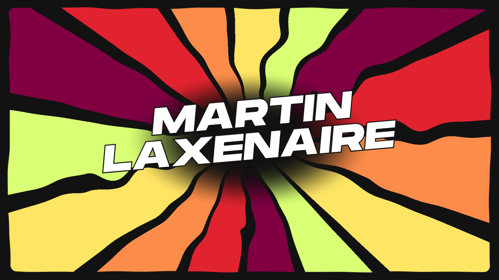

# 2025 Portfolio



Here you'll find the full code of my new 2025 portfolio - [martin-laxenaire.fr](https://www.martin-laxenaire.fr).

I've decided to publish it as a learning material. You might find some useful inspiration, from small UI components to full [gpu-curtains](https://martinlaxenaire.github.io/gpu-curtains/) WebGPU scenes.

This project is published under the [Creative Commons Attribution-NonCommercial 4.0 International License](LICENSE.md).

## Setup

It is built as a monorepo, containing a Sanity content studio in the `studio` folder, and a Nuxt application in the `front-end` folder.

### Clone the repository

```bash
git clone https://github.com/martinlaxenaire/portfolio-2025.git

cd portfolio-2025
```

### Sanity

Check the [studio README](./studio/README.md).

### Nuxt front-end

Check the [front-end README](./front-end/README.md).
